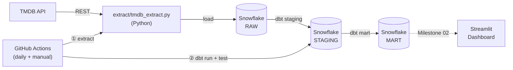

# Streaming Marketing Analytics — Paramount+

An end-to-end analytics engineering portfolio project targeting the **Analyst, Marketing Analytics** role at Paramount+. Built to demonstrate SQL pipelines, dimensional modeling, automated data engineering, and business intelligence skills required by the role.

**Central question:** Which content attributes define high-performing titles in the streaming era — and what does that tell Paramount+ about where to invest?

---

## Job Target

| Field | Detail |
|---|---|
| Role | Analyst, Marketing Analytics |
| Company | Paramount+ |
| Posting | [Indeed — Analyst, Marketing Analytics, Paramount+](https://www.indeed.com/viewjob?jk=de0d07e5d5eadda5) |
| Proposal | [docs/proposal.pdf](docs/proposal.pdf) |

---

## Tech Stack

| Layer | Tool |
|---|---|
| Data Warehouse | Snowflake |
| Transformation | dbt |
| Orchestration | GitHub Actions (scheduled) |
| Dashboard | Streamlit (Streamlit Community Cloud) |
| Knowledge Base | Claude Code |
| Language | Python |
| Version Control | Git + GitHub |

---

## Pipeline Architecture



**Tools:** Python · Snowflake · dbt · GitHub Actions · Streamlit (Milestone 02)

---

## Star Schema

> ERD to be generated from dbt models in Milestone 02.

**Fact table:** `fct_content_performance` — popularity score, vote average, vote count per title

**Dimensions:** `dim_genre`, `dim_studio`, `dim_date`

---

## Setup

### Prerequisites

- Python 3.11+
- Snowflake trial account (AWS US East 1)
- dbt Core (`pip install dbt-snowflake`)
- A TMDB API key (free at [themoviedb.org](https://www.themoviedb.org))

### Environment Variables

Create a `.env` file (never committed):

```
TMDB_API_KEY=your_key_here
SNOWFLAKE_ACCOUNT=your_account
SNOWFLAKE_USER=your_user
SNOWFLAKE_PASSWORD=your_password
SNOWFLAKE_DATABASE=STREAMING_ANALYTICS
SNOWFLAKE_WAREHOUSE=COMPUTE_WH
SNOWFLAKE_ROLE=SYSADMIN
```

### Run the Pipeline Locally

```bash
# Extract and load TMDB data to Snowflake
python extract/tmdb_extract.py

# Run dbt transformations
cd dbt
dbt deps
dbt run
dbt test

# Launch dashboard
cd dashboard
streamlit run app.py
```

---

## Repo Structure

```
streaming-marketing-analytics/
├── docs/
│   ├── job-posting.pdf
│   └── proposal.pdf
├── extract/
│   └── tmdb_extract.py
├── dbt/
│   ├── dbt_project.yml
│   ├── profiles.yml.example
│   └── models/
│       ├── staging/
│       │   ├── stg_tmdb_movies.sql
│       │   └── stg_tmdb_tv_shows.sql
│       └── mart/
│           ├── fct_content_performance.sql
│           ├── dim_genre.sql
│           ├── dim_studio.sql
│           └── dim_date.sql
├── dashboard/
│   └── app.py
├── knowledge/
│   ├── raw/
│   ├── wiki/
│   └── index.md
├── .github/
│   └── workflows/
│       └── tmdb_pipeline.yml
├── CLAUDE.md
├── README.md
└── .gitignore
```

---

## Key Insights

> To be completed in Milestone 02 after dashboard is built.

---

## Milestones

| Milestone | Due | Status |
|---|---|---|
| Proposal | Apr 13, 2026 | Complete |
| Milestone 01: Extract, Load & Transform | Apr 27, 2026 | In progress |
| Milestone 02: Present & Polish | May 4, 2026 | Upcoming |
| Final Submission | May 11, 2026 | Upcoming |
