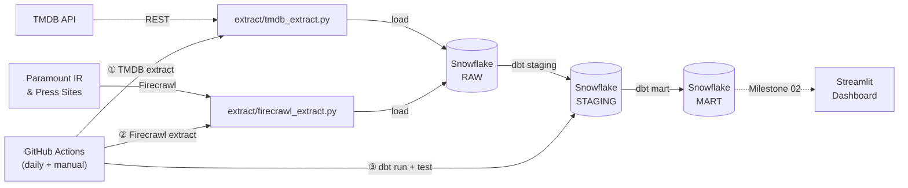

# Streaming Marketing Analytics — Paramount+

An end-to-end analytics engineering portfolio project targeting the **Analyst, Marketing Analytics** role at Paramount+. Built to demonstrate SQL pipelines, dimensional modeling, automated data engineering, and business intelligence skills required by the role.

**Central question:** Which content attributes define high-performing titles in the streaming era — and what does that tell Paramount+ about where to invest?

---

## Job Target

| Field | Detail |
|---|---|
| Role | Analyst, Marketing Analytics |
| Company | Paramount+ |
| Posting | [Indeed — Analyst, Marketing Analytics, Paramount+](https://www.indeed.com/viewjob?jk=de0d07e5d5eadda5) |
| Proposal | [docs/proposal.pdf](docs/proposal.pdf) |

---

## Tech Stack

| Layer | Tool |
|---|---|
| Data Warehouse | Snowflake |
| Transformation | dbt |
| Orchestration | GitHub Actions (scheduled) |
| Dashboard | Streamlit (Streamlit Community Cloud) |
| Knowledge Base | Claude Code |
| Language | Python |
| Version Control | Git + GitHub |

---

## Pipeline Architecture


```mermaid
flowchart LR
    A[TMDB API] -->|REST| B["extract/tmdb_extract.py"]
    W["Paramount IR\n& Press Sites"] -->|Firecrawl| FC["extract/firecrawl_extract.py"]
    B -->|load| C[("Snowflake\nRAW")]
    FC -->|load| C
    C -->|dbt staging| D[("Snowflake\nSTAGING")]
    D -->|dbt mart| E[("Snowflake\nMART")]
    E -.->|Milestone 02| F["Streamlit\nDashboard"]
    G["GitHub Actions\n(daily + manual)"] -->|"① TMDB extract"| B
    G -->|"② Firecrawl extract"| FC
    G -->|"③ dbt run + test"| D
```

**Tools:** Python · Snowflake · dbt · GitHub Actions · Streamlit (Milestone 02)

---

## Star Schema

```
fct_content_performance
├── content_sk (PK)
├── content_id
├── content_type          → "movie" | "tv"
├── title
├── popularity_score
├── vote_average
├── vote_count
├── release_year          → dim_date.release_year (FK)
├── primary_genre_id      → dim_genre.genre_id (FK, matched with content_type)
├── origin_country        → dim_studio.origin_country (FK, matched with original_language)
└── original_language

dim_genre                     dim_date                  dim_studio
├── genre_sk (PK)             ├── release_year (PK)     ├── studio_sk (PK)
├── genre_id                  ├── decade                ├── origin_country
├── genre_name                └── era                   └── original_language
└── content_type                   classic / streaming
                                   era / post-covid
```

**Fact table:** `fct_content_performance` — one row per title, with popularity score, vote average, vote count

**Dimensions:** `dim_genre` (genre × content type), `dim_studio` (origin country × language), `dim_date` (year, decade, era)

---

## Setup

### Prerequisites

- Python 3.11+
- Snowflake trial account (AWS US East 1)
- dbt Core (`pip install dbt-snowflake`)
- A TMDB API key (free at [themoviedb.org](https://www.themoviedb.org))

### Environment Variables

Create a `.env` file (never committed):

```
TMDB_API_KEY=your_key_here
SNOWFLAKE_ACCOUNT=your_account
SNOWFLAKE_USER=your_user
SNOWFLAKE_PASSWORD=your_password
SNOWFLAKE_DATABASE=STREAMING_ANALYTICS
SNOWFLAKE_WAREHOUSE=COMPUTE_WH
SNOWFLAKE_ROLE=SYSADMIN
```

### Run the Pipeline Locally

```bash
# Extract and load TMDB data to Snowflake
python extract/tmdb_extract.py

# Run dbt transformations
cd dbt
dbt deps
dbt run
dbt test

# Launch dashboard
cd dashboard
streamlit run app.py
```

---

## Repo Structure

```
streaming-marketing-analytics/
├── docs/
│   ├── job-posting.pdf
│   └── proposal.pdf
├── extract/
│   ├── tmdb_extract.py
│   └── firecrawl_extract.py
├── dbt/
│   ├── dbt_project.yml
│   ├── profiles.yml.example
│   └── models/
│       ├── staging/
│       │   ├── stg_tmdb_content.sql
│       │   └── stg_tmdb_genres.sql
│       └── mart/
│           ├── fct_content_performance.sql
│           ├── dim_genre.sql
│           ├── dim_studio.sql
│           └── dim_date.sql
├── dashboard/
│   ├── app.py
│   └── requirements.txt
├── knowledge/
│   ├── raw/              # 17 scraped sources
│   ├── wiki/             # synthesized analysis pages
│   └── index.md
├── tests/
│   └── test_snowflake_mart.py
├── .github/
│   └── workflows/
│       └── tmdb_pipeline.yml
├── CLAUDE.md
├── README.md
└── .gitignore
```

---

## Key Insights

Preliminary findings from the TMDB dataset (full analysis in the dashboard):

- **Action and Drama dominate popularity** across both movies and TV, while genres like Documentary and History lead in vote averages — quality signal vs. reach signal diverge by genre.
- **TV content has surged post-2015** in both volume and popularity score, reflecting the streaming era's shift from a movie-first to series-first content model.
- **Post-COVID titles (2020+) outperform catalog** on raw popularity but not vote average — newer content benefits from algorithm exposure, while older catalog earns higher critical scores over time.
- **English-language content leads on reach; non-English content (ko, ja, es) leads on ratings** — consistent with the global streaming trend where international originals (Squid Game, Parasite) punch above their weight on audience scores.
- **Vote count and vote average show weak positive correlation** (r ≈ 0.1–0.2), confirming they measure different things: breadth of audience vs. audience satisfaction.

---

## Milestones

| Milestone | Due | Status |
|---|---|---|
| Proposal | Apr 13, 2026 | Complete |
| Milestone 01: Extract, Load & Transform | Apr 27, 2026 | Complete |
| Milestone 02: Present & Polish | May 4, 2026 | Complete |
| Final Submission | May 11, 2026 | Upcoming |
