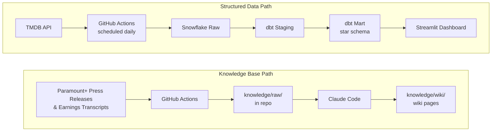

# Project Design: streaming-marketing-analytics

**Date:** 2026-04-08
**Job target:** Analyst, Marketing Analytics — Paramount+
**Proposal due:** 2026-04-13

---

## Project Framing

**Repo name:** `streaming-marketing-analytics`

**Central question:** Which content attributes define high-performing titles in the streaming era — and what does that tell Paramount+ about where to invest?

**Transferability:** Ports directly to Netflix, Disney+, HBO Max, Peacock, or any media/entertainment analytics role requiring SQL pipelines and content strategy analysis.

### Business Questions

**Descriptive (what happened?):**
- Which genres have the highest average popularity and vote scores?
- How has content type (movie vs. TV) distribution shifted by release decade?
- Which studios produce the most high-rated content?

**Diagnostic (why did it happen?):**
- Do higher vote counts (proxy for reach) correlate with higher ratings?
- Which genre + content type combinations consistently outperform?
- Are newer releases outperforming catalog content, or is the reverse true?

---

## Data Sources

### Source 1: TMDB REST API (structured pipeline)
- **Endpoints:** `/discover/movie`, `/discover/tv`, `/genre/movie/list`, `/genre/tv/list`
- **Pull:** Top-rated and popular titles across all genres, paginated
- **Raw targets:** `SNOWFLAKE.RAW.tmdb_movies`, `SNOWFLAKE.RAW.tmdb_tv_shows`
- **Auth:** Free API key, stored as `TMDB_API_KEY` GitHub Actions secret

### Source 2: Paramount+ press releases & earnings call transcripts (knowledge base)
- **Method:** Web scrape via Firecrawl or direct HTTP
- **Targets:** Paramount Global investor relations page, earnings call transcripts, press release archive
- **Volume:** 15+ raw sources from 3+ different sections/authors
- **Purpose:** Feed `knowledge/raw/` → synthesize into wiki pages

---

## Star Schema (dbt mart layer)

### Fact Table: `fct_content_performance`
| Column | Type | Description |
|---|---|---|
| content_id | VARCHAR | Surrogate key |
| genre_id | VARCHAR | FK to dim_genre |
| studio_id | VARCHAR | FK to dim_studio |
| date_id | VARCHAR | FK to dim_date |
| content_type | VARCHAR | 'movie' or 'tv' |
| popularity_score | FLOAT | TMDB popularity metric |
| vote_average | FLOAT | Avg user rating (0–10) |
| vote_count | INTEGER | Total votes (proxy for reach) |
| release_year | INTEGER | Year of release |

### Dimension Tables

**`dim_genre`**
| Column | Type |
|---|---|
| genre_id | VARCHAR |
| genre_name | VARCHAR |
| content_type | VARCHAR |

**`dim_studio`**
| Column | Type |
|---|---|
| studio_id | VARCHAR |
| studio_name | VARCHAR |
| origin_country | VARCHAR |

**`dim_date`**
| Column | Type |
|---|---|
| date_id | VARCHAR |
| release_year | INTEGER |
| release_decade | INTEGER |
| era | VARCHAR | 'classic' (≤2007), 'streaming era' (2008–2019), 'post-covid' (2020+) |

### dbt Layers
- `stg_tmdb_movies` — rename columns, cast types, deduplicate
- `stg_tmdb_tv_shows` — rename columns, cast types, deduplicate
- `fct_content_performance` — union movies + TV, resolve genre/studio keys
- `dim_genre`, `dim_studio`, `dim_date` — clean dimensions with surrogate keys

---

## Pipeline Architecture



### GitHub Actions
- **Schedule:** Daily cron for TMDB extract + load
- **Secrets:** `SNOWFLAKE_USER`, `SNOWFLAKE_PASSWORD`, `SNOWFLAKE_ACCOUNT`, `SNOWFLAKE_DATABASE`, `TMDB_API_KEY`
- No credentials committed to repo

---

## Streamlit Dashboard

**Deployment:** Streamlit Community Cloud (public URL)

**Tab 1 — Descriptive Analytics ("What happened?")**
- Genre leaderboard by average popularity score
- Content type breakdown (movie vs. TV) by decade
- Top 10 studios by average vote score

**Tab 2 — Diagnostic Analytics ("Why did it happen?")**
- Genre × content type heatmap (vote average)
- Vote count vs. vote average scatter plot (reach vs. quality)
- Decade-over-decade trend lines by genre

**Interactive elements:** Genre multi-selector, content type toggle (movie / TV / both)

---

## Knowledge Base

**Structure:**
```
knowledge/
├── raw/           # 15+ scraped sources (press releases, earnings transcripts)
├── wiki/
│   ├── overview.md          # Paramount+ strategy and business context
│   ├── key-entities.md      # Content pillars, subscriber milestones, key executives
│   └── content-strategy-synthesis.md  # Cross-source synthesis of content bets
└── index.md       # One-line summaries of all wiki pages
```

**Sources (target 15+ from 3+ origins):**
- Paramount Global investor relations press releases
- Quarterly earnings call transcripts
- Paramount+ content announcement press releases
- Investor Day presentation documents

---

## Repo Structure

```
streaming-marketing-analytics/
├── docs/
│   ├── job-posting.pdf
│   └── proposal.pdf
├── extract/
│   └── tmdb_extract.py
├── dbt/
│   ├── dbt_project.yml
│   ├── profiles.yml.example
│   └── models/
│       ├── staging/
│       │   ├── stg_tmdb_movies.sql
│       │   └── stg_tmdb_tv_shows.sql
│       └── mart/
│           ├── fct_content_performance.sql
│           ├── dim_genre.sql
│           ├── dim_studio.sql
│           └── dim_date.sql
├── dashboard/
│   └── app.py
├── knowledge/
│   ├── raw/
│   ├── wiki/
│   └── index.md
├── .github/
│   └── workflows/
│       └── tmdb_pipeline.yml
├── CLAUDE.md
├── README.md
└── .gitignore
```

---

## Proposal Reflection Paragraph (draft)

> This Paramount+ Marketing Analytics role requires the exact skills covered in this course: SQL for extracting and transforming data, dimensional modeling for structuring analytical outputs, automated pipelines for reliable data delivery, and dashboards that translate data into business decisions. The role specifically calls out experience with data pipelines, reporting, and visualization tools — all core course deliverables. My project builds an end-to-end analytics pipeline using TMDB content data to answer the question of which content attributes define high-performing streaming titles, modeling the kind of analysis a Paramount+ marketing analyst would run to inform content investment and media spend decisions. The skills demonstrated — SQL transformations in dbt, Snowflake data warehousing, GitHub Actions orchestration, and Streamlit dashboarding — map directly to the technical requirements listed in the job description, while the knowledge base built from Paramount+ earnings calls and press releases demonstrates domain fluency in the streaming industry.

---

## Milestone Checklist

| Milestone | Due | Key Deliverables |
|---|---|---|
| Proposal | 2026-04-13 | `docs/job-posting.pdf`, `docs/proposal.pdf`, initialized repo with CLAUDE.md |
| Milestone 01 | 2026-04-27 | TMDB extract + Snowflake load, dbt staging + mart, GitHub Actions, pipeline diagram |
| Milestone 02 | 2026-05-04 | Paramount+ web scrape, Streamlit dashboard (deployed), knowledge base, README, ERD, slides |
| Final | 2026-05-11 | `docs/resume.pdf`, final interview demo |
