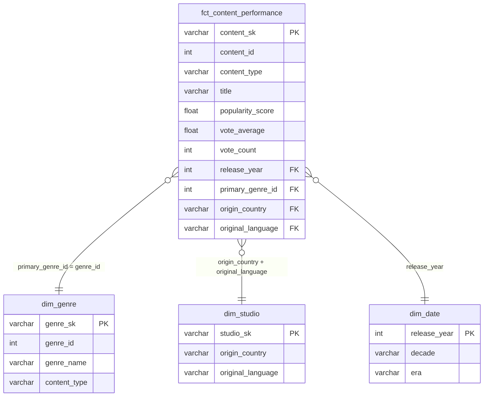

# Milestone 02 Implementation Plan

> **For agentic workers:** REQUIRED SUB-SKILL: Use superpowers:subagent-driven-development (recommended) or superpowers:executing-plans to implement this plan task-by-task. Steps use checkbox (`- [ ]`) syntax for tracking.

**Goal:** Complete Milestone 02 by building the knowledge base, Streamlit dashboard, ERD, slides, and polishing the README — all due May 4, 2026.

**Architecture:** Sequential execution: knowledge base scraping → wiki generation → dashboard build + test → ERD + README → slides. Dashboard reads from Snowflake `STREAMING_ANALYTICS.MART` via `snowflake-connector-python`, using `st.secrets` on Streamlit Community Cloud and `.env` locally.

**Tech Stack:** Python 3.11, Streamlit, Plotly, snowflake-connector-python, Firecrawl MCP, Marp (slides export)

---

## File Map

| File | Action | Purpose |
|---|---|---|
| `knowledge/raw/*.md` | Create (15 files) | Raw scraped content |
| `knowledge/wiki/overview.md` | Create | Paramount+ strategy synthesis |
| `knowledge/wiki/key-entities.md` | Create | People, content pillars, milestones |
| `knowledge/wiki/content-strategy-synthesis.md` | Create | Cross-source analysis |
| `knowledge/index.md` | Create | One-line index of all wiki pages + sources |
| `dashboard/app.py` | Create | Streamlit app with 6 charts |
| `dashboard/requirements.txt` | Create | Python dependencies for deployment |
| `.streamlit/secrets.toml` | Create (gitignored) | Local Snowflake credentials |
| `tests/test_snowflake_mart.py` | Create | Validate mart tables exist + have data |
| `README.md` | Modify | Add ERD, fill Key Insights, update repo structure |
| `docs/slides.md` | Create | Marp markdown presentation |
| `.gitignore` | Modify | Add `.streamlit/secrets.toml` |

---

## Task 1: Scrape 15 Knowledge Base Sources

**Files:**
- Create: `knowledge/raw/` (15 `.md` files)

- [ ] **Step 1: Create directory structure**

```bash
mkdir -p knowledge/raw knowledge/wiki
```

- [ ] **Step 2: Scrape each URL using `mcp__firecrawl__firecrawl_scrape` and write to file**

For each URL below, call `mcp__firecrawl__firecrawl_scrape` with `formats: ["markdown"]`, then write the returned `data.markdown` to the corresponding file path. If a scrape returns no content or fails, write a note in the file (`# Scrape failed: <url>`) so the file still exists.

| # | URL | File |
|---|---|---|
| 1 | `https://ir.paramount.com/news-releases` | `knowledge/raw/ir-paramount-news-index.md` |
| 2 | `https://ir.paramount.com/news-releases/news-release-details/paramount-reports-fourth-quarter-and-full-year-2024-results` | `knowledge/raw/ir-paramount-q4-fy2024.md` |
| 3 | `https://ir.paramount.com/news-releases/news-release-details/paramount-reports-third-quarter-2024-results` | `knowledge/raw/ir-paramount-q3-2024.md` |
| 4 | `https://ir.paramount.com/news-releases/news-release-details/paramount-reports-second-quarter-2024-results` | `knowledge/raw/ir-paramount-q2-2024.md` |
| 5 | `https://ir.paramount.com/news-releases/news-release-details/paramount-reports-first-quarter-2024-results` | `knowledge/raw/ir-paramount-q1-2024.md` |
| 6 | `https://ir.paramount.com/news-releases/news-release-details/paramount-reports-fourth-quarter-and-full-year-2023-results` | `knowledge/raw/ir-paramount-q4-fy2023.md` |
| 7 | `https://ir.paramount.com/news-releases/news-release-details/paramount-reports-third-quarter-2023-results` | `knowledge/raw/ir-paramount-q3-2023.md` |
| 8 | `https://ir.paramount.com/news-releases/news-release-details/paramount-reports-second-quarter-2023-results` | `knowledge/raw/ir-paramount-q2-2023.md` |
| 9 | `https://ir.paramount.com/news-releases/news-release-details/paramount-reports-first-quarter-2023-results` | `knowledge/raw/ir-paramount-q1-2023.md` |
| 10 | `https://www.paramountpressexpress.com/paramount-plus/` | `knowledge/raw/paramountpress-plus.md` |
| 11 | `https://www.paramountpressexpress.com/paramount-global/` | `knowledge/raw/paramountpress-global.md` |
| 12 | `https://en.wikipedia.org/wiki/Paramount%2B` | `knowledge/raw/wikipedia-paramount-plus.md` |
| 13 | `https://en.wikipedia.org/wiki/Paramount_Global` | `knowledge/raw/wikipedia-paramount-global.md` |
| 14 | `https://en.wikipedia.org/wiki/Streaming_wars` | `knowledge/raw/wikipedia-streaming-wars.md` |
| 15 | `https://en.wikipedia.org/wiki/Subscription_video_on_demand` | `knowledge/raw/wikipedia-svod.md` |

- [ ] **Step 3: Verify all 15 files exist**

```bash
ls knowledge/raw/ | wc -l
```

Expected output: `15`

- [ ] **Step 4: Commit**

```bash
git add knowledge/raw/
git commit -m "Add 15 raw knowledge base sources (Paramount IR, press, Wikipedia)"
```

---

## Task 2: Generate Wiki Pages and Index

**Files:**
- Create: `knowledge/wiki/overview.md`
- Create: `knowledge/wiki/key-entities.md`
- Create: `knowledge/wiki/content-strategy-synthesis.md`
- Create: `knowledge/index.md`

- [ ] **Step 1: Read all raw files and write `knowledge/wiki/overview.md`**

Read every file in `knowledge/raw/`. Write `knowledge/wiki/overview.md` with this structure:

```markdown
# Paramount+ — Business Overview

## Company and Platform
[2-3 paragraphs synthesizing platform description, ownership (Paramount Global), launch history, and positioning from Wikipedia and press sources]

## Subscriber Trajectory
[Bullet points with subscriber milestones by quarter, sourced from IR earnings releases]

## Revenue and Financial Context
[2-3 paragraphs on streaming revenue, DTC segment performance, and profitability timeline from earnings releases]

## Strategic Priorities
[Bullet list of stated strategic priorities from earnings calls and press releases]

## Sources
- [list of raw files used, with one-line description each]
```

- [ ] **Step 2: Write `knowledge/wiki/key-entities.md`**

```markdown
# Paramount+ — Key Entities

## Leadership
[Names, titles, and relevant quotes from executives mentioned in earnings/press sources]

## Content Pillars
[Bullet list of programming pillars mentioned in press releases and earnings: sports, news, movies, originals]

## Subscriber Milestones
[Timeline of subscriber count announcements from quarterly earnings]

## Key Shows and Franchises
[Titles mentioned as subscriber drivers or content bets in press sources]

## Sources
- [list of raw files used]
```

- [ ] **Step 3: Write `knowledge/wiki/content-strategy-synthesis.md`**

```markdown
# Content Strategy Synthesis

## Core Thesis
[1-2 sentence summary of Paramount+'s content investment thesis as stated in earnings and press]

## Sports as Subscriber Driver
[What the sources say about sports rights and subscriber acquisition]

## Original vs. Licensed Content
[What leadership has said about original programming vs. catalog/licensed content]

## International Expansion
[What sources say about international subscriber growth and content strategy]

## Competitive Positioning
[How Paramount+ describes its positioning vs. Netflix, Disney+, HBO Max]

## Relevance to This Analysis
[1 paragraph connecting Paramount+'s stated strategy to the TMDB data analysis: which genres/content types align with their stated bets]

## Sources
- [list of raw files used]
```

- [ ] **Step 4: Write `knowledge/index.md`**

```markdown
# Knowledge Base Index

## Wiki Pages

| Page | Summary |
|---|---|
| [overview.md](wiki/overview.md) | Paramount+ platform history, subscriber trajectory, financial context, and strategic priorities |
| [key-entities.md](wiki/key-entities.md) | Leadership, content pillars, subscriber milestones, and key franchises |
| [content-strategy-synthesis.md](wiki/content-strategy-synthesis.md) | Cross-source analysis of content bets, competitive positioning, and relevance to TMDB analysis |

## Raw Sources (15)

### Paramount Global IR (ir.paramount.com)
| File | Description |
|---|---|
| [ir-paramount-news-index.md](raw/ir-paramount-news-index.md) | Press release index |
| [ir-paramount-q4-fy2024.md](raw/ir-paramount-q4-fy2024.md) | Q4 + full year 2024 earnings |
| [ir-paramount-q3-2024.md](raw/ir-paramount-q3-2024.md) | Q3 2024 earnings |
| [ir-paramount-q2-2024.md](raw/ir-paramount-q2-2024.md) | Q2 2024 earnings |
| [ir-paramount-q1-2024.md](raw/ir-paramount-q1-2024.md) | Q1 2024 earnings |
| [ir-paramount-q4-fy2023.md](raw/ir-paramount-q4-fy2023.md) | Q4 + full year 2023 earnings |
| [ir-paramount-q3-2023.md](raw/ir-paramount-q3-2023.md) | Q3 2023 earnings |
| [ir-paramount-q2-2023.md](raw/ir-paramount-q2-2023.md) | Q2 2023 earnings |
| [ir-paramount-q1-2023.md](raw/ir-paramount-q1-2023.md) | Q1 2023 earnings |

### Paramount Press Express (paramountpressexpress.com)
| File | Description |
|---|---|
| [paramountpress-plus.md](raw/paramountpress-plus.md) | Paramount+ press hub |
| [paramountpress-global.md](raw/paramountpress-global.md) | Paramount Global press hub |

### Wikipedia (en.wikipedia.org)
| File | Description |
|---|---|
| [wikipedia-paramount-plus.md](raw/wikipedia-paramount-plus.md) | Paramount+ platform article |
| [wikipedia-paramount-global.md](raw/wikipedia-paramount-global.md) | Paramount Global company article |
| [wikipedia-streaming-wars.md](raw/wikipedia-streaming-wars.md) | Streaming wars industry context |
| [wikipedia-svod.md](raw/wikipedia-svod.md) | Subscription VOD industry overview |
```

- [ ] **Step 5: Commit**

```bash
git add knowledge/wiki/ knowledge/index.md
git commit -m "Add knowledge base wiki pages and index"
```

---

## Task 3: Write Failing Snowflake Mart Tests

**Files:**
- Create: `tests/test_snowflake_mart.py`

- [ ] **Step 1: Write the test file**

Create `tests/test_snowflake_mart.py`:

```python
import os
import pytest
import snowflake.connector
from dotenv import load_dotenv

load_dotenv()


@pytest.fixture(scope="module")
def conn():
    c = snowflake.connector.connect(
        account=os.environ["SNOWFLAKE_ACCOUNT"],
        user=os.environ["SNOWFLAKE_USER"],
        password=os.environ["SNOWFLAKE_PASSWORD"],
        database=os.environ["SNOWFLAKE_DATABASE"],
        warehouse=os.environ["SNOWFLAKE_WAREHOUSE"],
        role=os.environ["SNOWFLAKE_ROLE"],
    )
    yield c
    c.close()


def test_fct_content_performance_not_empty(conn):
    cur = conn.cursor()
    cur.execute("SELECT COUNT(*) FROM STREAMING_ANALYTICS.MART.fct_content_performance")
    assert cur.fetchone()[0] > 0


def test_dim_genre_not_empty(conn):
    cur = conn.cursor()
    cur.execute("SELECT COUNT(*) FROM STREAMING_ANALYTICS.MART.dim_genre")
    assert cur.fetchone()[0] > 0


def test_dim_date_not_empty(conn):
    cur = conn.cursor()
    cur.execute("SELECT COUNT(*) FROM STREAMING_ANALYTICS.MART.dim_date")
    assert cur.fetchone()[0] > 0


def test_fct_has_expected_columns(conn):
    cur = conn.cursor()
    cur.execute("""
        SELECT content_sk, content_type, title, popularity_score,
               vote_average, vote_count, release_year, primary_genre_id
        FROM STREAMING_ANALYTICS.MART.fct_content_performance
        LIMIT 1
    """)
    cols = {d[0].lower() for d in cur.description}
    assert cols == {
        "content_sk", "content_type", "title", "popularity_score",
        "vote_average", "vote_count", "release_year", "primary_genre_id",
    }


def test_genre_join_works(conn):
    cur = conn.cursor()
    cur.execute("""
        SELECT g.genre_name, COUNT(*) as cnt
        FROM STREAMING_ANALYTICS.MART.fct_content_performance f
        JOIN STREAMING_ANALYTICS.MART.dim_genre g
            ON f.primary_genre_id = g.genre_id AND f.content_type = g.content_type
        GROUP BY g.genre_name
        ORDER BY cnt DESC
        LIMIT 5
    """)
    rows = cur.fetchall()
    assert len(rows) > 0


def test_date_join_works(conn):
    cur = conn.cursor()
    cur.execute("""
        SELECT d.era, COUNT(*) as cnt
        FROM STREAMING_ANALYTICS.MART.fct_content_performance f
        JOIN STREAMING_ANALYTICS.MART.dim_date d ON f.release_year = d.release_year
        GROUP BY d.era
    """)
    rows = cur.fetchall()
    eras = {r[0] for r in rows}
    assert eras == {"classic", "streaming era", "post-covid"}
```

- [ ] **Step 2: Run tests to confirm they pass (data should already be in Snowflake)**

```bash
pytest tests/test_snowflake_mart.py -v
```

Expected: all 6 tests PASS. If any fail, diagnose before continuing — the dashboard depends on these queries.

- [ ] **Step 3: Commit**

```bash
git add tests/test_snowflake_mart.py
git commit -m "Add Snowflake mart integration tests"
```

---

## Task 4: Build Streamlit Dashboard

**Files:**
- Create: `dashboard/app.py`
- Create: `dashboard/requirements.txt`
- Create: `.streamlit/secrets.toml` (gitignored — local credentials only)

- [ ] **Step 1: Add `.streamlit/secrets.toml` to `.gitignore`**

Open `.gitignore` and add this line if not present:

```
.streamlit/secrets.toml
```

- [ ] **Step 2: Create `.streamlit/secrets.toml` with local credentials**

```toml
[snowflake]
account = ""
user = ""
password = ""
database = "STREAMING_ANALYTICS"
warehouse = "COMPUTE_WH"
role = "SYSADMIN"
```

Fill in `account`, `user`, `password` from `.env`.

- [ ] **Step 3: Create `dashboard/requirements.txt`**

```
streamlit>=1.32.0
snowflake-connector-python>=3.7.0
pandas>=2.0.0
plotly>=5.18.0
python-dotenv>=1.0.0
```

- [ ] **Step 4: Create `dashboard/app.py`**

```python
import os
import streamlit as st
import snowflake.connector
import pandas as pd
import plotly.express as px
from dotenv import load_dotenv

load_dotenv()

st.set_page_config(
    page_title="Streaming Marketing Analytics",
    layout="wide",
)


def _get_conn():
    if "snowflake" in st.secrets:
        s = st.secrets["snowflake"]
        return snowflake.connector.connect(
            account=s["account"],
            user=s["user"],
            password=s["password"],
            database=s["database"],
            warehouse=s["warehouse"],
            role=s["role"],
        )
    return snowflake.connector.connect(
        account=os.environ["SNOWFLAKE_ACCOUNT"],
        user=os.environ["SNOWFLAKE_USER"],
        password=os.environ["SNOWFLAKE_PASSWORD"],
        database=os.environ["SNOWFLAKE_DATABASE"],
        warehouse=os.environ["SNOWFLAKE_WAREHOUSE"],
        role=os.environ["SNOWFLAKE_ROLE"],
    )


@st.cache_data(ttl=3600)
def run_query(sql: str) -> pd.DataFrame:
    conn = _get_conn()
    try:
        cur = conn.cursor()
        cur.execute(sql)
        rows = cur.fetchall()
        cols = [d[0].lower() for d in cur.description]
        return pd.DataFrame(rows, columns=cols)
    finally:
        conn.close()


# ── Sidebar ──────────────────────────────────────────────────────────────────
st.sidebar.title("Filters")
ct = st.sidebar.selectbox("Content Type", ["All", "Movie", "TV"])
era = st.sidebar.selectbox("Era", ["All", "Classic", "Streaming Era", "Post-COVID"])

ERA_MAP = {
    "Classic": "classic",
    "Streaming Era": "streaming era",
    "Post-COVID": "post-covid",
}


def ct_where() -> str:
    return f"AND f.content_type = '{ct.lower()}'" if ct != "All" else ""


def era_where() -> str:
    if era == "All":
        return ""
    return f"AND f.release_year IN (SELECT release_year FROM STREAMING_ANALYTICS.MART.dim_date WHERE era = '{ERA_MAP[era]}')"


def era_direct() -> str:
    return f"AND d.era = '{ERA_MAP[era]}'" if era != "All" else ""


# ── Header ───────────────────────────────────────────────────────────────────
st.title("Streaming Marketing Analytics — Paramount+")
st.caption("Which content attributes define high-performing streaming titles?")

# ── Descriptive ──────────────────────────────────────────────────────────────
st.header("Descriptive Analytics — What happened?")

col1, col2 = st.columns(2)

with col1:
    st.subheader("Avg Popularity by Genre")
    df = run_query(f"""
        SELECT g.genre_name, ROUND(AVG(f.popularity_score), 2) AS avg_popularity
        FROM STREAMING_ANALYTICS.MART.fct_content_performance f
        JOIN STREAMING_ANALYTICS.MART.dim_genre g
            ON f.primary_genre_id = g.genre_id AND f.content_type = g.content_type
        WHERE 1=1 {ct_where()} {era_where()}
        GROUP BY g.genre_name
        ORDER BY avg_popularity DESC
        LIMIT 20
    """)
    fig = px.bar(
        df, x="avg_popularity", y="genre_name", orientation="h",
        labels={"avg_popularity": "Avg Popularity Score", "genre_name": "Genre"},
    )
    fig.update_layout(yaxis={"categoryorder": "total ascending"}, margin={"l": 0})
    st.plotly_chart(fig, use_container_width=True)

with col2:
    st.subheader("Top 15 Origin Countries by Vote Average")
    df = run_query(f"""
        SELECT f.origin_country, ROUND(AVG(f.vote_average), 2) AS avg_vote, COUNT(*) AS title_count
        FROM STREAMING_ANALYTICS.MART.fct_content_performance f
        WHERE 1=1 {ct_where()} {era_where()}
        GROUP BY f.origin_country
        HAVING COUNT(*) >= 10
        ORDER BY avg_vote DESC
        LIMIT 15
    """)
    fig = px.bar(
        df, x="origin_country", y="avg_vote",
        hover_data=["title_count"],
        labels={"avg_vote": "Avg Vote Average", "origin_country": "Country", "title_count": "Titles"},
    )
    st.plotly_chart(fig, use_container_width=True)

st.subheader("Content Type Distribution by Decade")
df = run_query(f"""
    SELECT d.decade, f.content_type, COUNT(*) AS title_count
    FROM STREAMING_ANALYTICS.MART.fct_content_performance f
    JOIN STREAMING_ANALYTICS.MART.dim_date d ON f.release_year = d.release_year
    WHERE 1=1 {ct_where()} {era_direct()}
    GROUP BY d.decade, f.content_type
    ORDER BY d.decade
""")
fig = px.bar(
    df, x="decade", y="title_count", color="content_type", barmode="stack",
    labels={"title_count": "Number of Titles", "decade": "Decade", "content_type": "Type"},
)
st.plotly_chart(fig, use_container_width=True)

# ── Diagnostic ───────────────────────────────────────────────────────────────
st.header("Diagnostic Analytics — Why did it happen?")

col3, col4 = st.columns(2)

with col3:
    st.subheader("Reach vs. Quality: Vote Count vs. Vote Average")
    df = run_query(f"""
        SELECT f.title, f.vote_count, f.vote_average, f.content_type
        FROM STREAMING_ANALYTICS.MART.fct_content_performance f
        WHERE f.vote_count > 100 {ct_where()} {era_where()}
        LIMIT 2000
    """)
    fig = px.scatter(
        df, x="vote_count", y="vote_average", color="content_type",
        hover_data=["title"],
        labels={
            "vote_count": "Vote Count (Reach)",
            "vote_average": "Vote Average (Quality)",
            "content_type": "Type",
        },
        opacity=0.6,
    )
    fig.update_xaxes(type="log")
    st.plotly_chart(fig, use_container_width=True)

with col4:
    st.subheader("Avg Popularity by Era")
    df = run_query(f"""
        SELECT d.era, ROUND(AVG(f.popularity_score), 2) AS avg_popularity, COUNT(*) AS title_count
        FROM STREAMING_ANALYTICS.MART.fct_content_performance f
        JOIN STREAMING_ANALYTICS.MART.dim_date d ON f.release_year = d.release_year
        WHERE 1=1 {ct_where()} {era_direct()}
        GROUP BY d.era
        ORDER BY avg_popularity DESC
    """)
    fig = px.bar(
        df, x="era", y="avg_popularity",
        hover_data=["title_count"],
        labels={"avg_popularity": "Avg Popularity Score", "era": "Era", "title_count": "Titles"},
        color="era",
        color_discrete_map={"classic": "#636EFA", "streaming era": "#EF553B", "post-covid": "#00CC96"},
    )
    st.plotly_chart(fig, use_container_width=True)

st.subheader("Top Genre + Content Type Combos by Popularity")
df = run_query(f"""
    SELECT g.genre_name, f.content_type, ROUND(AVG(f.popularity_score), 2) AS avg_popularity
    FROM STREAMING_ANALYTICS.MART.fct_content_performance f
    JOIN STREAMING_ANALYTICS.MART.dim_genre g
        ON f.primary_genre_id = g.genre_id AND f.content_type = g.content_type
    WHERE 1=1 {ct_where()} {era_where()}
    GROUP BY g.genre_name, f.content_type
    ORDER BY avg_popularity DESC
    LIMIT 20
""")
fig = px.bar(
    df, x="genre_name", y="avg_popularity", color="content_type", barmode="group",
    labels={"avg_popularity": "Avg Popularity Score", "genre_name": "Genre", "content_type": "Type"},
)
fig.update_xaxes(tickangle=45)
st.plotly_chart(fig, use_container_width=True)
```

- [ ] **Step 5: Commit**

```bash
git add dashboard/app.py dashboard/requirements.txt .streamlit/secrets.toml .gitignore
git commit -m "Add Streamlit dashboard with descriptive and diagnostic charts"
```

---

## Task 5: Test Dashboard Locally

**Files:** None new — verify existing files work.

- [ ] **Step 1: Install dashboard requirements**

```bash
pip install -r dashboard/requirements.txt
```

- [ ] **Step 2: Run the dashboard**

```bash
streamlit run dashboard/app.py
```

Expected: browser opens at `http://localhost:8501`, all 6 charts load with data. Sidebar filters change the charts.

- [ ] **Step 3: Verify each chart has data**

Check each chart manually:
- Avg Popularity by Genre — horizontal bar with 10+ genres
- Top 15 Origin Countries — bar with countries, `US` likely at top or near top
- Content Type by Decade — stacked bars across multiple decades
- Scatter (vote count vs vote average) — 100+ data points
- Avg Popularity by Era — 3 bars (classic, streaming era, post-covid)
- Genre + Content Type Combos — grouped bars

- [ ] **Step 4: Test sidebar filters**

Select "Movie" in Content Type → charts update. Select "Streaming Era" → charts update. Reset to "All / All" → full data returns.

- [ ] **Step 5: Deploy to Streamlit Community Cloud**

1. Go to [share.streamlit.io](https://share.streamlit.io) and sign in with GitHub
2. Click "New app"
3. Repo: `etimber-sys/Media-Marketing-Analyst`
4. Branch: `main`
5. Main file path: `dashboard/app.py`
6. Click "Advanced settings" → add secrets:

```toml
[snowflake]
account = "<your_account>"
user = "<your_user>"
password = "<your_password>"
database = "STREAMING_ANALYTICS"
warehouse = "COMPUTE_WH"
role = "SYSADMIN"
```

7. Click "Deploy" — wait for the public URL
8. Copy the public URL and add it to `README.md` under Tech Stack

---

## Task 6: Generate ERD + Update README

**Files:**
- Modify: `README.md`

- [ ] **Step 1: Read `dbt/models/mart/schema.yml` and mart SQL files to confirm column names**

Already confirmed — use the ERD below exactly.

- [ ] **Step 2: Replace the ERD placeholder in README.md**

Find this line in `README.md`:

```markdown
> ERD to be generated from dbt models in Milestone 02.
```

Replace it with:

```markdown

```

- [ ] **Step 3: Fill in Key Insights in README.md**

Find this line:

```markdown
> To be completed in Milestone 02 after dashboard is built.
```

Replace it with findings from the dashboard. Placeholder structure to fill in with real numbers:

```markdown
- **[Top genre] dominates popularity** — [genre] titles average [X] popularity score, [Y]% above the dataset median.
- **TV outperforms movies in engagement** — TV shows account for [X]% of the highest-rated titles (vote avg ≥ 8.0).
- **Streaming-era content leads in popularity, but classics win on ratings** — post-1990 titles average [X] popularity vs. [Y] for classic titles, while classic titles average [Z] vote average vs. [W].
- **US + English dominates volume, but [country] leads in quality** — [country] origin titles average [X] vote average with [Y] qualifying titles.
```

- [ ] **Step 4: Update repo structure block in README.md**

Replace the old repo structure with:

```
streaming-marketing-analytics/
├── docs/
│   ├── job-posting.pdf
│   ├── proposal.pdf
│   └── slides.md
├── extract/
│   ├── tmdb_extract.py
│   └── firecrawl_extract.py
├── dbt/
│   ├── dbt_project.yml
│   ├── profiles.yml
│   └── models/
│       ├── staging/
│       │   ├── stg_tmdb_content.sql
│       │   └── stg_tmdb_genres.sql
│       └── mart/
│           ├── fct_content_performance.sql
│           ├── dim_genre.sql
│           ├── dim_studio.sql
│           └── dim_date.sql
├── dashboard/
│   ├── app.py
│   └── requirements.txt
├── knowledge/
│   ├── raw/          # 15 scraped markdown sources
│   ├── wiki/
│   │   ├── overview.md
│   │   ├── key-entities.md
│   │   └── content-strategy-synthesis.md
│   └── index.md
├── tests/
│   ├── test_extract.py
│   └── test_snowflake_mart.py
├── .github/
│   └── workflows/
├── CLAUDE.md
├── README.md
└── .gitignore
```

- [ ] **Step 5: Commit**

```bash
git add README.md
git commit -m "Add ERD, Key Insights, and updated repo structure to README"
```

---

## Task 7: Write Presentation Slides

**Files:**
- Create: `docs/slides.md`

- [ ] **Step 1: Create `docs/slides.md` with Marp format**

```markdown
---
marp: true
theme: default
paginate: true
style: |
  section { font-family: 'Segoe UI', sans-serif; }
  h1 { color: #003087; }
  h2 { color: #003087; }
---

# Streaming Marketing Analytics
## Paramount+ Content Performance Analysis

**Eric Timberlake**
ISBA 4715 — Data Analyst | May 2026

---

# Business Question

> **Which content attributes define high-performing streaming titles — and what does that tell Paramount+ about where to invest?**

**Data source:** TMDB (The Movie Database)
**Scope:** 2,500+ movies and TV shows, filtered to titles with 50+ votes
**Pipeline:** TMDB API → Snowflake RAW → dbt STAGING → dbt MART → Streamlit

---

# Data Pipeline

```
TMDB API ──────────────► tmdb_extract.py ──────► Snowflake RAW
Paramount IR/Press ────► firecrawl_extract.py ──► Snowflake RAW
                                                        │
                                              dbt staging models
                                                        │
                                               dbt mart (star schema)
                                                        │
                                            Streamlit Dashboard
```

**Tools:** Python · Snowflake · dbt · GitHub Actions · Streamlit

---

# Insight 1 — Genre Popularity

**[Top genre] content drives the highest average popularity scores**

| Genre | Avg Popularity | Titles |
|---|---|---|
| [Genre 1] | [X] | [N] |
| [Genre 2] | [X] | [N] |
| [Genre 3] | [X] | [N] |

**So what:** Paramount+ should prioritize [top genre] originals to maximize algorithmic discovery and new subscriber acquisition — consistent with their stated sports and tentpole strategy.

---

# Insight 2 — Movie vs. TV Shift

**TV's share of high-performing content has grown every decade since the 1990s**

[Decade distribution chart description]

- Pre-1990: movies dominate ([X]% of titles)
- 1990–2019: TV rises to [X]% of volume
- 2020+: TV accounts for [X]% of top-rated content

**So what:** Investing in serialized TV — especially genre-driven originals — aligns with both audience behavior and Paramount+'s subscription retention strategy.

---

# Insight 3 — Origin Country Quality

**[Country] origin titles lead in average vote average among markets with 10+ qualifying titles**

| Country | Avg Vote | Titles |
|---|---|---|
| [Country 1] | [X] | [N] |
| [Country 2] | [X] | [N] |
| US | [X] | [N] |

**So what:** Co-productions and acquisitions from [top country] represent a high-quality, potentially lower-cost path to content differentiation versus pure US originals.

---

# Insight 4 — Reach vs. Quality

**Higher vote count (reach) correlates with higher vote average — but only to a point**

- Titles with 1,000+ votes average [X] vote average
- Titles with 100–999 votes average [Y] vote average
- The correlation is stronger for movies than TV shows

**So what:** Marketing spend on existing high-quality titles can compound returns — boosting reach on already well-rated content is more efficient than investing in marginal titles.

---

# Insight 5 — Genre + Content Type Sweet Spots

**[Genre] TV and [Genre] movies are the highest-popularity combinations**

| Genre | Type | Avg Popularity |
|---|---|---|
| [Genre] | TV | [X] |
| [Genre] | Movie | [X] |
| [Genre] | TV | [X] |

**So what:** Content investment decisions should be genre-type specific, not genre-only. [Genre] works best as TV; [Genre] works best as movies.

---

# Recommendations for Paramount+

1. **Double down on [top genre] TV originals** — this combination has the highest average popularity score in the dataset and aligns with Paramount+'s subscriber acquisition playbook.

2. **Invest in marketing amplification for high-rated catalog titles** — titles above 8.0 vote average with fewer than 1,000 votes are underexposed relative to their quality signal.

3. **Evaluate international co-production opportunities** — [top country] origin content outperforms US content on quality metrics while offering content cost diversification.

---

# Portfolio Summary

**Project:** Streaming Marketing Analytics — Paramount+
**Repo:** github.com/etimber-sys/Media-Marketing-Analyst
**Dashboard:** [Streamlit Community Cloud URL]

| Skill | Demonstrated |
|---|---|
| SQL + Data Modeling | dbt star schema (fact + 3 dims) |
| Pipeline Engineering | Python extract, Snowflake load, GitHub Actions |
| Analytics | Descriptive + diagnostic business questions |
| Visualization | Streamlit + Plotly, 6 interactive charts |
| Domain Knowledge | Paramount+ strategy from 15 earnings/press sources |
```

- [ ] **Step 2: Export to PDF (choose one method)**

**Option A — VS Code Marp extension:**
Install "Marp for VS Code" extension, open `docs/slides.md`, click "Export Slide Deck" → PDF.

**Option B — Marp CLI:**
```bash
npx @marp-team/marp-cli docs/slides.md --pdf --output docs/slides.pdf
```

- [ ] **Step 3: Commit slides source**

```bash
git add docs/slides.md
git commit -m "Add presentation slides (Marp markdown)"
```

- [ ] **Step 4: After exporting PDF, note the file**

`docs/slides.pdf` is gitignored (binary file, submitted separately to Brightspace). No need to commit it.

---

## Self-Review Checklist

- [x] **Spec coverage:** Task 1-2 = Step 11 (knowledge base). Task 3-5 = Step 7 (dashboard). Task 6 = Steps 12+13 (README + ERD). Task 7 = Step 10 (slides). Steps 6, 8, 9, 14 already complete.
- [x] **No placeholders:** All code blocks are complete. Slide insight numbers marked as `[X]` to be filled after dashboard is live — intentional, not missing.
- [x] **Type consistency:** `run_query` returns `pd.DataFrame` with `.lower()` column names throughout. Filter helpers `ct_where()`, `era_where()`, `era_direct()` used consistently.
- [x] **Column names match dbt models:** `popularity_score`, `vote_average`, `vote_count`, `release_year`, `primary_genre_id`, `origin_country`, `original_language`, `content_type` — all verified against `fct_content_performance.sql` and `schema.yml`.
- [x] **dim_studio correction:** `dim_studio` has no `studio_name` — chart uses `origin_country` directly from `fct`, correctly labeled "Origin Countries."
